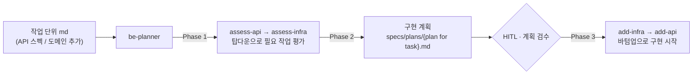

# dk-be-bundle: Spring Boot 멀티모듈 작업 플러그인

Spring Boot 멀티모듈 백엔드 작업을 **작고 전형적인 단위로 쪼개** Claude Code 스킬로 자동화하는 플러그인.

## 설계 원칙

1. **LLM 요청은 작고 전형적일수록** 결과가 예측 가능하고 검사가 쉽다 — 이 전제에서 출발합니다.
2. Spring Boot 멀티모듈을 구성하는 핵심 요소를 **모듈/하위 폴더 단위**로 나누고, 각각의 **역할·형태·예시**를 정의합니다.
   - API · 도메인 데이터 · usecase 인터페이스 · DB entity 스펙 · DB persistence 인터페이스
3. (2)에서 정의한 작업 단위를 각각 독립된 **Skill**로 만듭니다.
4. 이를 실제로 수행하기 위한 **`be-planner` 스킬**과 레이어별 **`assess-{module}` 스킬**을 둡니다.
5. API 스펙·도메인 추가 같은 작업은 **작업 단위를 md로 입력**하면, 어떤 하위 스킬을 어떤 파라미터로 실행할지 **planner가 결정**합니다.

## 동작 흐름



각 레이어(api / usecase / infrastructure / model)를 개별 스킬이 담당하고, `be-planner`가 평가→계획→구현을 오케스트레이션합니다.

## planner 예시

기존 서비스에 **알림(Notification) API와 데이터 스펙**을 추가했을 때 `be-planner`가 생성한 HITL 검수 문서입니다.

- 결과 문서: [`examples/notification-crud.md`](examples/notification-crud.md)

이 문서를 검수(HITL)한 뒤, 각 모듈에 대한 구현 작업을 수행합니다.

---

## 설치

```bash
# 로컬 테스트 (플러그인 경로 지정 실행)
claude --plugin-dir /path/to/dk-be-bundle

# 개인 영구 설치
claude plugin install /path/to/dk-be-bundle --scope user

# 프로젝트 공유 (팀 .claude/settings.json 에 기록)
claude plugin install /path/to/dk-be-bundle --scope project
```

---

## 스킬 목록 (16개 공개)

모든 스킬은 `dk-be-bundle:` 네임스페이스 로 호출.

| 그룹 | 스킬 | 용도 |
|---|---|---|
| **오케스트레이션** | `be-planner` | API 스펙 1개 → assess 체인 → 구현 계획 → 역순 실행 |
| **스캐폴드** | `be-init` | 빈 멀티모듈 프로젝트 생성 (8 모듈 + gradle wrapper + 공통 클래스 + 테스트 인프라) |
| **평가 (top-down)** | `be-assess-api` | API 레이어 충족 여부 평가 |
| | `be-assess-usecase` | usecase 레이어 평가 |
| | `be-assess-infra` | infrastructure port 평가 |
| | `be-assess-model` | 도메인 모델 평가 |
| **구현 (bottom-up)** | `be-add-model` | 도메인 모델 (`{Domain}` / `{Domain}Read` / `{Domain}Identity`) |
| | `be-add-infrastructure` | Repository port 인터페이스 |
| | `be-add-entity-specs` | Entity 클래스 + DDL append |
| | `be-add-jdbc-query` | JdbcRepository + EntityRepository |
| | `be-add-usecase` | Reader / Writer / Usecase |
| | `be-add-api` | Controller + Request/Response DTO |
| **Elasticsearch** | _(향후 공개)_ | ES 인덱싱·검색 스킬 — 추후 공개 예정 |
| **테스트** | `be-test-api` | Controller 단위 테스트 (Mockito) |
| | `be-test-service` | Reader/Writer/Usecase 단위 테스트 (Mockito) |
| | `be-test-repository-jdbc` | JdbcRepository 통합 테스트 (H2 mem 슬라이스) |
| | `be-test-service-concurrency` | Writer 동시성/순서 통합 테스트 |

---

## Quick Start

### 새 프로젝트

```bash
# 1. 빈 스캐폴드 생성
/dk-be-bundle:be-init
# projectName, group, packageRoot, projectRoot 를 대화로 받음

# 2. 첫 도메인 종단 생성 (예: Article CRUD)
/dk-be-bundle:be-planner
# API 스펙 1개 제시 → assess 체인 → 구현 계획 확인 → 역순 실행

# 3. 테스트 추가
/dk-be-bundle:be-test-repository-jdbc
/dk-be-bundle:be-test-service
/dk-be-bundle:be-test-api
```

### 기존 프로젝트 (be-init 이미 실행된 상태)

```bash
# API 추가
/dk-be-bundle:be-planner

# 개별 레이어만 수정
/dk-be-bundle:be-add-usecase
/dk-be-bundle:be-add-api
```

---

## be-planner — 오케스트레이터

3-phase 흐름:

**Phase 1: Assess (top-down)** — `assess-api` → `assess-usecase` → `assess-infra` → `assess-model`
각 레이어에서 요구 API 가 현재 코드로 충족되는지 판정. 충족된 레이어에서 체인 중단.

**Phase 2: Plan** — assess 결과를 모아 구현 계획 수립. 유저에게 제시하고 확정.

**Phase 3: Add (bottom-up)** — `add-model` → `add-infrastructure` → `add-entity-specs` → `add-jdbc-query` → `add-usecase` → `add-api`
미충족 레이어만 실행. 각 단계에서 specs doc 에 산출물 기록.

**산출물**: `specs/plans/{api-name}.md` (plan doc). 각 phase 의 결과를 누적 기록.

---

## be-init — 처음 빈 프로젝트에서 시작하기

아래의 요소가 생성됩니다.

1. 8 모듈 (`api-application`, `api`, `service`, `repository-jdbc`, `infrastructure`, `model`, `schema`, `exception`) + Gradle wrapper 8.5 생성
2. `Application.java` + `@EnableJdbcAuditing`
3. `AuditFields` 인터페이스 (audit 계약)
4. `DomainException` (abstract) + `HttpException` (interface) + 구체 4종 (`EntityNotFoundException`/`ConflictException`/`ForbiddenException`/`InvalidInputException`)
5. `GlobalExceptionHandler` + `ErrorResponse` (api-application/config/)
6. `IntegrationTestBase` — repository-jdbc 슬라이스 / service 통합 각각
7. `TestApplication.java` (+ `@EnableJdbcAuditing`) — slice 테스트 부트스트랩
8. `application.yml` / `application-local.yml` (H2 file) / `application-test.yml` (H2 mem)
9. `schema.sql` (주석만, `local_h2/` 하위)
10. `IntegrationConfig.java` — service 통합 테스트용 SpringBootTest 구성

생성 직후 검증 명령을 실행하고, 실패 시 원인 분류표 기반으로 최대 3회 자가 수정.

**Usage:**

```
/dk-be-bundle:be-init
```

입력 받는 4개:
- `projectName` — 예: `my-service-be`
- `group` — Gradle group, 예: `com.example.board`
- `packageRoot` — Java 패키지 루트 (group 과 달라도 됨)
- `projectRoot` — 생성 위치 절대 경로

---

## 프로젝트 설정 (`dk-be-bundle.config.json`)

스킬이 자동 탐지 (build.gradle.kts 의 `group`, `modules/` 스캔) 하지만 명시 설정이 있으면 우선 사용.

프로젝트 루트에 배치:

```json
{
  "packageRoot": "com.example.board",
  "modulesPath": "modules",
  "modules": {
    "api": "modules/api",
    "service": "modules/service",
    "repository-jdbc": "modules/repository-jdbc",
    "schema": "modules/schema",
    "model": "modules/model",
    "infrastructure": "modules/infrastructure"
  },
  "es": {
    "module": "ai-search",
    "packageSuffix": "aisearch",
    "indexName": "setup",
    "host": "localhost:9200"
  }
}
```

모든 필드 선택. 빠진 값은 자동 탐지 → 실패 시 유저에게 질의.
해석 규칙: [`references/plugin-config-resolver.md`](references/plugin-config-resolver.md)

---

## 호환 스택

| 항목 | 버전 / 값 |
|---|---|
| Gradle | 8.5 (Kotlin DSL) |
| Spring Boot | 3.2.1 |
| Java | 21 |
| io.spring.dependency-management | 1.1.4 |
| Lombok | 1.18.30 |
| JUnit BOM | 5.14.0 |
| Mockito BOM | 5.20.0 |
| AssertJ | 3.26.3 |
| Springdoc OpenAPI | 2.3.0 |
| DB | H2 (local file + test mem, `MODE=MySQL;CASE_INSENSITIVE_IDENTIFIERS=TRUE;DATABASE_TO_LOWER=TRUE`) |
| Data | Spring Data JDBC (JPA 아님) |
| ES (선택) | elasticsearch-java 8.x |

구조가 다른 프로젝트는 config 로 경로만 맞추면 대부분 동작. 다만 도메인 관례(Reader/Writer 분리, AuditFields 매핑, port-adapter 의존 방향)는 변경하지 않는다.

---

## 파일 레이아웃 (생성 후)

```
{projectRoot}/
├── settings.gradle.kts
├── build.gradle.kts              # java toolchain 21 + -parameters + BOM imports
├── gradle/wrapper/               # 8.5
├── dk-be-bundle.config.json      # (선택)
└── modules/
    ├── applications/api-application/
    │   └── src/main/java/{packagePath}/
    │       ├── Application.java              # @SpringBootApplication @EnableJdbcAuditing
    │       └── application/config/
    │           ├── GlobalExceptionHandler.java
    │           └── ErrorResponse.java
    ├── api/                                   # Controller + dto
    ├── service/                               # Reader/Writer/Usecase + dto/impl/usecase
    ├── repository-jdbc/                       # Entity + JdbcRepository + EntityRepository
    ├── infrastructure/                        # Repository port interfaces
    ├── model/                                 # 도메인 모델 + AuditFields interface
    ├── schema/
    │   └── src/main/resources/local_h2/schema.sql
    └── exception/                             # DomainException + HttpException + 4종
```

---

## 참고 문서

- [`references/be-refs/`](references/be-refs/) — 도메인/엔티티/쿼리/스키마/서비스/인프라/API 패턴 레퍼런스
- [`references/be-test-refs/`](references/be-test-refs/) — 테스트 패턴 레퍼런스
- [`references/plugin-config-resolver.md`](references/plugin-config-resolver.md) — 프로젝트 컨텍스트 자동 해석 규칙

---

## 라이선스

MIT
